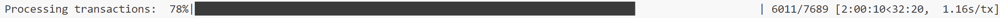

# 项目简介
本项目旨在利用Python编程语言及其Selenium库来实现对受Cloudflare保护的区块链数据网站（https://blockexplorer.one/）的数据爬取。通过使用undetected-chromedriver这一工具，绕过Cloudflare的图灵测试，从而获取以太坊交易记录的相关信息，包括交易From地址、To地址、交易金额、交易时间戳以及交易费。所有收集到的数据最终会被保存为CSV格式的文件，以便于进一步分析或处理。

# 开发要点
## 1．反爬取方法
使用了undetected_chromedriver作为主要手段来规避Cloudflare的检测机制。这个库可以模拟人类行为，降低被识别为自动化脚本的风险。

## 2．XPath语句
抓取每个字段时，使用了特定的XPath表达式定位页面元素：

| 元素     | XPath                                               |
| -------- | --------------------------------------------------- |
| From     | `.//td[@class="fromContent"]/div/a`                 |
| To地址   | `.//td[@class="toContent"]/div/a`                   |
| 交易金额 | `.//td[@class="amountTransacted"]/b`                |
| 交易时间 | `.//td[@class="dateTime tooltip"]/span`             |
| 交易费   | `.//td[@class="fee"]/div`                           |

## 3．异常处理
由于数据量较大，需要针对给定的2w个以太坊交易记录Hash，抓取其交易From地址、交易To地址、交易金额（Transaction Amount）、交易时间（转换为Unix时间戳）、交易Fee等数据。因此程序中需要包含异常处理逻辑，确保在遇到问题时（如网络错误或元素未找到），仍能继续处理下一个哈希值而不中断整个流程。
## 4．断点续传
程序引入检查点机制，允许程序从上次中断的地方继续执行，避免重复工作并提高效率。
## 5．日志记录
对每一个处理过的哈希值进行了记录，保证不会重复处理相同的数据。
## 6．结果输出
数据被追加写入到CSV文件中，确保即使程序中途停止，之前的结果也不会丢失。
# 三、运行效果、运行关键步骤截图
程序成功实现了对给定以太坊交易哈希列表的遍历，并针对每个哈希值正确地抓取了所需的交易详情。以下是几个重要的运行环节：
## 1．启动浏览器
成功启动带有undetected_chromedriver配置的Chrome浏览器实例。

## 2．加载页面
对于每个哈希值，程序都能够正常加载对应的交易详情页面，并等待必要的元素出现。

## 3．抓取数据
根据预定义的XPath路径，准确地提取了交易的各项信息。

## 4．保存结果
将抓取到的信息以结构化的方式保存到了CSV文件中，确保数据易于阅读和后续处理。程序运行过程中控制台输出的日志信息，特别是显示进度条的部分。

